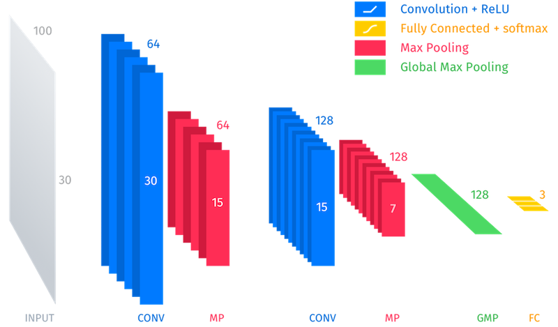
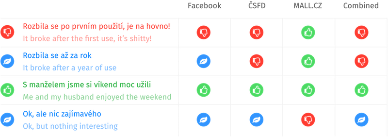

# Sentence-Level Analysis Using Word Embeddings And CNNs
*This experiment was my capstone project for Machine Learning Nanodegree at Udacity.*

The overall goal of this project was to create a simple sentence-level **sentiment classifier for the Czech language** that will differentiate between neutral, negative and positive sentiments.

It leverages the power of **word embeddings** for representing text data in 100-dimensional vector space and two-layer **convolutional neural network** for extracting features from the encoded text data.

Main evaluation metric for the classifier is *categorical accuracy* computed on the testing set and *weighted F1 score*. Baseline is a *weighted random guess*.

[**→ Open the project notebook**][project notebook] 
[→ Download the full project report][fullreport]

## Project Summary
Findings and notes from the research by [Habernal et al. (2013)][habernal] which explored the sentiment recognition in Czech social media posts were used to guide the project. Datasets for the experiment also come from the same research team.

### Datasets
There are three sets [provided by the team](http://liks.fav.zcu.cz/sentiment/):

- **Facebook:** 10 000 samples
  with 2 587 positive, 5 174 neutral, 1 991 negative and 248 bipolar posts
- **ČSFD (Czech Film Database):** 91 381 samples
 with 30 897 positive, 30 768 neutral, and 29 716 negative movie reviews
- **MALL.CZ (largest all-round e-commerce in Czechia):** 145 307 samples
 with 102 977 positive, 31 943 neutral, and 10 387 negative product reviews

The corpora however contain entries of arbitrary lengths. Since the goal was *sentence-level* classifier, it was necessary to filter out any samples that were longer than one sentence. 

You can read more on extensive data pre-processing in [the full report][fullreport].

### Models
Since there were multiple datasets available, **4 individual models were trained on different subsets and joints** (three original corpora and one combined). All models share the same convolutional neural network architecture (displayed below), but were trained on different batch sizes and number of epochs.

During its training, network tries to minimalize the cross entropy loss evaluated on the cross validation set which is obtained by withholding 15% of the training data.

&nbsp;

&nbsp;

## Results

| *model*    | Accuracy Score | F1 Score | Naïve Accuracy | Naïve F1 | Cross Entropy | # of Epochs | Batch Size |
| :------- | -----: | ---: | -----: | ---: | -----: | ---: | ---: |
| Facebook | 71.62% | 0.71 | 38.43% | 0.39 | 0.6102 | 5    | 20   |
| ČSFD     | 71.34% | 0.71 | 33.88% | 0.33 | 0.6283 | 5    | 20   |
| MALL.CZ  | 82.52% | 0.81 | 62.51% | 0.62 | 0.4495 | 20   | 1000 |
| Combined | 67.82% | 0.67 | 32.23% | 0.67 | 0.7333 | 20   | 1000 |

The picture below displays four new fabricated questions and visualizes their predictions using the 4 trained models. Freely translated English versions are attached for reference.

Note how the second sentence was chosen in contrast to the first one. It also illustrates the upper accuracy limit of sentiment analysis mentioned in the research by [Habernal et al. (2013)][habernal]. While some might see it as clearly neutral, it does have indications of negativity and might cause different labelling even among humans.

You can read more on the results justification in [the full report][fullreport].

&nbsp;

---

## Running the Project

Development code is written in **Python 3** and can be found in [the project Notebook][project notebook]. All important functions do have defined *docstring* with sufficient explanation of their inner workings. 

### Libraries used:
- Pandas
- NumPy
- scikit-learn
- NLTK
- Seaborn
- matplotlib
- Keras (TensorFlow backend)
- fastText
- [`czech_stemmer.py`](http://research.variancia.com/czech_stemmer/)

### Installing fastText

Since fastText library doesn't have a stable Python wrapper yet, it is used in the project via `subprocess`.

You will however need a working `fasttext` binary. One for Mac is already provided in the `lib` directory. If that one doesn't work for you, you can build our own binary by [following this easy guide](https://fasttext.cc/docs/en/support.html).

In any case, please make sure there is a working **`fasttext`** binary in the **`lib`** directory as a script in the project will make a call to the file on that explicit path.

### Provided data

All of the text datasets are already provided in the `data` directory. However, they can be downloaded from their [origin here](http://liks.fav.zcu.cz/sentiment/).

The weights for our trained models are also included in `models` directory. You can load them up by calling a `.load()` method on a `CNN` model instance. However, if you try training them again in the Notebook, these weights will be overwritten.

### Data to be generated

When running the cells in provided Notebook, certain new data will be created as well. 

Inside `data` directory, these files will be generated:
- a `.txt` file for word vectors training
- 8 `.npy` files holding final processed text data in numpy array format

After training the words vectors using fastText, a `combined_corpora_processed.bin` word model will be saved in `word_models` directory.

---

## Licensing

### Code and Implementation
Copyright © 2017 Radek Kyselý.

Licensed under [MIT](https://github.com/kysely/sentiment-analysis-czech/blob/sentence-level/LICENSE)

### Datasets
Copyright © 2013 Ivan Habernal, Tomáš Ptáček and Josef Steinberger.

Licensed under [Creative Commons Attribution-NonCommercial-ShareAlike 3.0 Unported License](https://github.com/kysely/sentiment-analysis-czech/blob/sentence-level/licenses/DATASETS)

### fastText Library
Copyright © 2016-present, Facebook, Inc. All rights reserved.

Licensed under [BSD](https://github.com/kysely/sentiment-analysis-czech/blob/sentence-level/licenses/FASTTEXT)

### Czech Stemmer
Copyright © 2010 Luís Gomes. 
Original Java version by Ljiljana Dolamic, University of Neuchatel.

Licensed under [Creative Commons Attribution 3.0 Unported License](https://github.com/kysely/sentiment-analysis-czech/blob/sentence-level/licenses/CZECH_STEMMER)

---

[← See more experiments of Czech sentiment analysis](https://github.com/kysely/sentiment-analysis-czech)

[project notebook]: https://github.com/kysely/sentiment-analysis-czech/blob/sentence-level/Sentiment%20Analysis%20in%20Czech.ipynb
[fullreport]: https://github.com/kysely/sentiment-analysis-czech/blob/sentence-level/capstone_report.pdf
[habernal]: http://www.aclweb.org/anthology/W13-1609